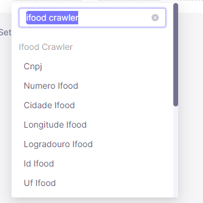

# Sumário
  
  * [Utilização do Cube.js](#utilização-do-cubejs) 
    * [Sugestão de montagem das Dimensões e Filtros](#sugestão-de-montagem-das-dimensões-e-filtros)
    * [Exemplos](#exemplos)
  * [Origem dos Dados](#origem-dos-dados)
    * [Descrição](#descrição)
    * [Dados disponíveis](#dados-disponíveis)
    * [Retorno completo (json)](#retorno-completo-json)

# Guia de schemas

Esta documentação tem como objetivo ser um facilitador e propor autonomia para o melhor aproveitamento do cubo de dados.

## Utilização do Cube.js

### Sugestão de montagem das Dimensões e Filtros

Na montagem das dimensões e filtros sugiro digitar "ifood Crawler" na busca dos campos, com isso aparecerá todos os campos desse esquema.

### Exemplos

<a href="http://10.0.44.102:4000/#/build?query={%22limit%22:100,%22filters%22:[{%22member%22:%22IfoodCrawler.cnpj%22,%22operator%22:%22equals%22,%22values%22:[%2233772618000129%22]}],%22measures%22:[%22IfoodCrawler.count%22],%22dimensions%22:[%22IfoodCrawler.idIfood%22,%22IfoodCrawler.cidade_ifood%22,%22IfoodCrawler.mcc%22,%22IfoodCrawler.json_grupos%22],%22order%22:{%22IfoodCrawler.count%22:%22desc%22}}">Exemplo 1</a>

## Origem dos Dados

### Descrição

Esses dados foram coletados atráves dos detalhes exibidos no site do Ifood o retorno é em forma de json com varias informações.  
Todos os valores dos campos disponíveis foram retirados do <a href=#retorno-completo-json>Json de retorno</a>, os campos separados para facilitar a consulta dos dados mais utilizados.<a href=#retorno-completo-json>Exemplo do Json de retorno</a>

### Dados disponíveis

<table>
  <thead>
    <tr>
      <th valign="center">Campo</th>
      <th valign="center">Exemplo</th>
      <th valign="center">Descrição</th>
    </tr>
  </thead>
  <tbody>
    <tr valign="center">
      <td><strong>cnpj</strong></td>
      <td valign= "center">39339339000139</td>
      <td valign= "center">Cnpj do Cliente</td>
    </tr>
    <tr valign="center">
      <td><strong>cidade ifood</strong></td>
      <td valign= "center">Campinas</td>
      <td valign= "center">Cidade do estabelecimento</td>
    </tr>
    <tr valign="center">
      <td><strong>uf ifood</strong></td>
      <td valign= "center">SP</td>
      <td valign= "center">Uf do estabelecimento</td>
    </tr>
    <tr valign="center">
      <td><strong>latitude ifood</strong></td>
      <td valign= "center">-23.273661</td>
      <td valign= "center">Latitude do estabelecimento</td>
    </tr>
    <tr valign="center">
      <td><strong>longitude ifood</strong></td>
      <td valign= "center">-46.744197</td>
      <td valign= "center">Longitude do estabelecimento</td>
    </tr>
    <tr valign="center">
      <td><strong>cep ifood</strong></td>
      <td valign= "center">19500000</td>
      <td valign= "center">CEP do estabelecimento</td>
    </tr>
    <tr valign="center">
      <td><strong>logradouro ifood</strong></td>
      <td valign= "center">Rua das Bromélias</td>
      <td valign= "center">Logradouro do estabelecimento</td>
    </tr>
    <tr valign="center">
      <td><strong>numero ifood</strong></td>
      <td valign= "center">283</td>
      <td valign= "center">Número do estabelecimento</td>
    </tr>
    <tr valign="center">
      <td><strong>json groups</strong></td>
      <td valign= "center"><pre>
      <small>
        [
          {
            "id": "d107726d-f66f-4c25-bd82-edca0bbacbd2", 
            "name": "IFOOD", 
            "type": "COMPANY", 
            "externalId": "IFO"
          }, {
            "id": "c6409bde-74cc-45ed-bfd4-408afd4d828c", 
            "name": "Full Service", 
            "type": "BUSINESS_MODEL", 
            "externalId": "FULL_SERVICE"
          }, {
            "id": "d004b2d3-e8c8-4901-9b79-4b7146f6289a", 
            "name": "Jundiai", 
            "type": "REGION", 
            "externalId": "c9773f8f-900e-4998-8f2b-37785a9c678b"
          }, {
            "id": "2b69a2f0-6ac8-4eda-b4b2-9d9d5f578054", 
            "name": "RESTAURANT", 
            "type": "STORE_TYPE", 
            "externalId": "RESTAURANT"
          }
        ]
      </small></pre></td>
      <td valign= "center"> Nó retirada do retorno para facilitar a consulta no Json   <a href=#retorno-completo-json>Json Completo</a></td>
    </tr>
    <tr valign="center">
      <td><strong>json shifts</strong></td>
      <td valign= "center"><pre><small>
      [
          {"dayOfWeek": "MONDAY", "start": "18:00:00", "duration": 300}, 
          {"dayOfWeek": "SATURDAY", "start": "18:00:00", "duration": 300}, 
          {"dayOfWeek": "MONDAY", "start": "11:00:00", "duration": 240}, 
          {"dayOfWeek": "WEDNESDAY", "start": "11:00:00", "duration": 240}, 
          {"dayOfWeek": "FRIDAY", "start": "11:00:00", "duration": 240}, 
          {"dayOfWeek": "THURSDAY", "start": "18:00:00", "duration": 300}, 
          {"dayOfWeek": "SUNDAY", "start": "18:00:00", "duration": 300}, 
          {"dayOfWeek": "TUESDAY", "start": "11:00:00", "duration": 240}, 
          {"dayOfWeek": "FRIDAY", "start": "18:00:00", "duration": 300}, 
          {"dayOfWeek": "TUESDAY", "start": "18:00:00", "duration": 300}, 
          {"dayOfWeek": "THURSDAY", "start": "11:00:00", "duration": 240}, 
          {"dayOfWeek": "WEDNESDAY", "start": "18:00:00", "duration": 300}, 
          {"dayOfWeek": "SUNDAY", "start": "11:00:00", "duration": 240},
          {"dayOfWeek": "SATURDAY", "start": "11:00:00", "duration": 240}
      ]
      </small></pre></td>
      <td valign= "center"> Nó retirada do retorno para facilitar a consulta no Json   <a href=#retorno-completo-json>Json Completo</a></td>
    </tr>
    <tr valign="center">
      <td><strong>json documents</strong></td>
      <td valign= "center"><pre>
      {"CNPJ": {"type": "CNPJ", "value": "39339339000139"}, 
      "MCC": {"type": "MCC", "value": "5499"}}
      </pre></td>
      <td valign= "center"> Nó retirada do retorno para facilitar a consulta no Json   <a href=#retorno-completo-json>Json Completo</a></td>
    </tr>
    <tr valign="center">
      <td><strong>id ifood</strong></td>
      <td valign= "center">da129710-22a5-490c-9417-bb555bb498b3</td>
      <td valign= "center">Id Ifood</td>
    </tr>
    <tr valign="center">
      <td><strong>nome cliente</strong></td>
      <td valign= "center">Drogaria America Vp</td>
      <td valign= "center">Nome do Clietne</td>
    </tr>
    <tr valign="center">
      <td><strong>mcc</strong></td>
      <td valign= "center">5499</td>
      <td valign= "center">Mcc cadastro no Ifood</td>
    </tr>
    <tr valign="center">
      <td><strong>preparation Time</strong></td>
      <td valign= "center">16</td>
      <td valign= "center">Tempo medio de preparação em minutos</td>
    </tr>
    <tr valign="center">
      <td><strong>user Rating Count</strong></td>
      <td valign= "center">26.0</td>
      <td valign= "center"> </td>
    </tr>
    <tr valign="center">
      <td><strong>minimum order value</strong></td>
      <td valign= "center">20</td>
      <td valign= "center"> </td>
    </tr>
    <tr valign="center">
      <td><strong>phone if</strong></td>
      <td valign= "center">910510741</td>
      <td valign= "center"> </td>
    </tr>
    <tr valign="center">
      <td><strong>json result</strong></td>
      <td valign= "center">
      <pre>
      <small>
        {
          "id": "e8337482-8446-4d56-8d20-86fb6de3a589",
          "shortId": 1281485,
          "name": "Lanch\u00e3o & Cia - Francisco Morato",
          "companyCode": "IFO",
          "address": { ... },
          "resources": [ ... ],
          "takeoutTime": 0,
          "deliveryTime": 0,
          "minimumOrderValue": 0,
          "enabled": true,
          "phoneIf": "930668296",
          "tags": [ ... ],
          "merchantChain": { ... },
          "groups": [ ... ],
          "shifts": [ ... ],
          "priceRange": "CHEAPEST",
          "mainCategory": { ... },
          "categories": [ ... ],
          "features": [ ... ],
          "configs": { ... },
          "userRatingCount": 0.0,
          "locale": "pt_BR",
          "type": "RESTAURANT",
          "documents": { ... },
          "metadata": { ... },
          "test": "NOT_APPLICABLE",
          "preparationTime": 0,
          "setups": [ ... ]
        }
        </small>
      </pre></td>
      <td valign= "center">Resultado retornado na consulta   <a href=#retorno-completo-json>Json Completo</a></td>
    </tr>
  </tbody>
</table>

### Retorno completo (json)

<pre>
{
    "id": "e8337482-8446-4d56-8d20-86fb6de3a589",
    "shortId": 1281485,
    "name": "Lanch\u00e3o & Cia - Francisco Morato",
    "companyCode": "IFO",
    "address": {
        "district": "Parque Bel\u00e9m",
        "city": "FRANCISCO MORATO",
        "state": "SP",
        "country": "BR",
        "latitude": -23.273661,
        "longitude": -46.744197,
        "timezone": "Etc/GMT+3",
        "zipCode": "07942010",
        "streetName": "Rua Belo Horizonte",
        "streetNumber": "47"
    },
    "resources": [
        {
            "type": "LOGO",
            "fileName": "e8337482-8446-4d56-8d20-86fb6de3a589/202012161454_klRO_i.jpg"
        },
        {
            "type": "COVER",
            "fileName": "e8337482-8446-4d56-8d20-86fb6de3a589/202012161454_RVKJ_p.png"
        }
    ],
    "takeoutTime": 0,
    "deliveryTime": 0,
    "minimumOrderValue": 0,
    "enabled": true,
    "phoneIf": "930668296",
    "tags": [
        "MENUCOMPLETO_JUN22",
        "RES_COCA_LISTALANCHES",
        "MER_CREPEPANQ",
        "AQS_RESTAURANTES_ELEGIVEIS_CUPONS_V3",
        "AQS_RESTAURANTES_ELEGIVEIS_CUPONS_V2",
        "RES_MAI21_COCA_SOCIAL",
        "ITENS_HAMBURGUER",
        "GUARANAANTARCTICA_ITENS_CI",
        "SO_TEM_NO_IFOOD",
        "FAMOSOS_IFOOD_JAN22",
        "MER_HOTDOG",
        "AQS_RESTAURANTES_ELEGIVEIS_SEM_CID_MADURAS",
        "NOVIDADE_IFOOD_DEZ20 ",
        "COCA_ITENS_3",
        "COCA_ITENS_2",
        "PARCEIROS_COCA",
        "SMALL_ORDER_FEE",
        "AQS_RESTAURANTES_ELEGIVEIS_CUPONS",
        "RESTAURANTES",
        "MENUINDIVIDUAL_JUN22",
        "CLUBEVIP_FOOD",
        "KEY_ACCOUNT",
        "GUIDED_HELP_TYPE",
        "SMART_CAMPAIGN_FOOD_DELIVERY",
        "RES_MAI21_COCA_SOCIAL_LOJAS",
        "PRATOS_SOPAS_CALDOS",
        "RES_MAI21_COCA_CUPOMLT",
        "GRANDES_MARCAS_MARCO",
        "RANKING_FASTFOODS_FEV21",
        "ADDRESS_PREFORM_TYPE",
        "NEW"
    ],
    "merchantChain": {
        "id": "6b377d25-db82-4643-838d-2f17c6a0f772",
        "name": "Lanch\u00e3o & Cia",
        "externalId": "47068"
    },
    "groups": [
        {
            "id": "2b69a2f0-6ac8-4eda-b4b2-9d9d5f578054",
            "type": "STORE_TYPE",
            "externalId": "RESTAURANT",
            "name": "RESTAURANT"
        },
        {
            "id": "d107726d-f66f-4c25-bd82-edca0bbacbd2",
            "type": "COMPANY",
            "externalId": "IFO",
            "name": "IFOOD"
        },
        {
            "id": "820474aa-1b61-4686-b706-02988cf60d21",
            "type": "BUSINESS_MODEL",
            "externalId": "HYBRID_REGION",
            "name": "Entrega+"
        },
        {
            "id": "f20dda9c-ea7c-4159-9c80-9d5d23baab5e",
            "type": "CATALOG",
            "externalId": "f20dda9c-ea7c-4159-9c80-9d5d23baab5e",
            "name": "Lanch\u00e3o & Cia - Promobomb"
        },
        {
            "id": "e96832aa-b0cb-422b-87da-66a120b1faf4",
            "type": "REGION",
            "externalId": "f002ac35-efe2-446f-a255-36659a23b7e1",
            "name": "Franco da Rocha"
        }
    ],
    "shifts": [
        {
            "dayOfWeek": "MONDAY",
            "start": "18:00:00",
            "duration": 359
        },
        {
            "dayOfWeek": "WEDNESDAY",
            "start": "18:00:00",
            "duration": 359
        },
        {
            "dayOfWeek": "FRIDAY",
            "start": "18:00:00",
            "duration": 359
        },
        {
            "dayOfWeek": "SUNDAY",
            "start": "18:00:00",
            "duration": 359
        },
        {
            "dayOfWeek": "SATURDAY",
            "start": "18:00:00",
            "duration": 359
        },
        {
            "dayOfWeek": "THURSDAY",
            "start": "18:00:00",
            "duration": 359
        },
        {
            "dayOfWeek": "TUESDAY",
            "start": "18:00:00",
            "duration": 359
        }
    ],
    "priceRange": "CHEAPEST",
    "mainCategory": {
        "code": "LCH",
        "description": "Lanches",
        "friendlyName": "Lanches"
    },
    "categories": [],
    "features": [
        "DELIVERY",
        "TAKEOUT",
        "CANCELABLE",
        "CHAT_CONSUMER_ENABLED",
        "USES_IFOOD_LOGISTICS"
    ],
    "configs": {
        "orderNoteLength": 140,
        "chargeDifferentToppingsMode": "GREATER"
    },
    "userRatingCount": 0.0,
    "locale": "pt_BR",
    "type": "RESTAURANT",
    "documents": {
        "MCC": {
            "type": "MCC",
            "value": "5814"
        },
        "CNPJ": {
            "type": "CNPJ",
            "value": "39359320000178"
        }
    },
    "metadata": {
        "ifoodClub": {
            "banner": {
                "image": "https://static-images.ifood.com.br/image/upload/:resolution/ifood-club/ClubiFoodVoucher.png",
                "title": "Economize at\u00e9 70% com o Clube iFood",
                "action": "webmiddleware?page=https%3A%2F%2Fwebmiddleware.ifood.com.br%2Fmarketplace%2Fclub%3Fref%3Dlingueta",
                "priority": "voucher_light"
            }
        }
    },
    "test": "NOT_APPLICABLE",
    "preparationTime": 0,
    "setups": [
        {
            "setupId": "c2ee6471-805c-43b4-b21c-d3e6ac7941d5",
            "operation": {
                "id": "aba3c1a2-8d97-4c13-b863-eaf1e9382158",
                "name": "delivery"
            },
            "salesChannel": {
                "id": "01667b79-f98b-4742-9a55-b482066cbfed",
                "name": "ifood-app"
            },
            "openingHours": [
                {
                    "id": "3ca43e30-0932-4553-9e34-ceaf87357c0d",
                    "dayOfWeek": "MONDAY",
                    "start": "18:00:00",
                    "duration": 359
                },
                {
                    "id": "05642ad5-42ca-4b60-be68-867b6ae6b648",
                    "dayOfWeek": "WEDNESDAY",
                    "start": "18:00:00",
                    "duration": 359
                },
                {
                    "id": "62320b18-cf99-4355-933f-a60136de2b68",
                    "dayOfWeek": "FRIDAY",
                    "start": "18:00:00",
                    "duration": 359
                },
                {
                    "id": "7fee503e-7990-4aca-a154-4182dadc21bf",
                    "dayOfWeek": "SUNDAY",
                    "start": "18:00:00",
                    "duration": 359
                },
                {
                    "id": "b4f792dc-3796-4070-ae6f-f3d712536361",
                    "dayOfWeek": "SATURDAY",
                    "start": "18:00:00",
                    "duration": 359
                },
                {
                    "id": "9b07b1b3-fd3b-428d-94a5-f99048760b54",
                    "dayOfWeek": "THURSDAY",
                    "start": "18:00:00",
                    "duration": 359
                },
                {
                    "id": "f973657a-5dd1-4e9b-af83-c1e25a4cee06",
                    "dayOfWeek": "TUESDAY",
                    "start": "18:00:00",
                    "duration": 359
                }
            ],
            "preparationTime": 0,
            "minimumOrderValue": 0.0
        },
        {
            "setupId": "e60bf8b5-da9f-4bec-a5a6-1ca8de216b7e",
            "operation": {
                "id": "4f8de698-fee2-450a-bfc4-157bbe2a7c6b",
                "name": "takeout"
            },
            "salesChannel": {
                "id": "01667b79-f98b-4742-9a55-b482066cbfed",
                "name": "ifood-app"
            }
        }
    ]
}
</pre>

<!-- END graphql-markdown -->
