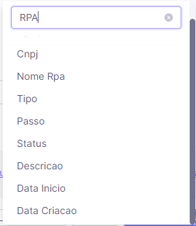

# Sumário
  
  * [Utilização do Cube.js](#utilização-do-cubejs) 
    * [Sugestão de montagem das Dimensões e Filtros](#sugestão-de-montagem-das-dimensões-e-filtros)
    * [Exemplo](#exemplo-playground)
    * [cURL](#curl)
  * [Origem dos Dados](#origem-dos-dados)
  * [Dados disponíveis](#dados-disponíveis)

# Guia de schemas

Esta documentação tem como objetivo ser um facilitador e propor autonomia para o melhor aproveitamento do cubo de dados.

## Utilização do Cube.js

### Sugestão de montagem das Dimensões e Filtros

Na montagem das dimensões e filtros sugiro digitar "RPA" na busca dos campos, com isso aparecerá todos os campos desse esquema.

### Exemplo Playground

<a href="http://10.0.44.102:4000/#/build?query={%22measures%22:[%22LogRpa.count%22],%22dimensions%22:[%22LogRpa.nomeRpa%22,%22LogRpa.passo%22,%22LogRpa.cnpj%22,%22LogRpa.tipo%22,%22LogRpa.status%22,%22LogRpa.dataInicio%22,%22LogRpa.dataCriacao%22],%22order%22:{%22LogRpa.count%22:%22desc%22},%22filters%22:[{%22member%22:%22LogRpa.nomeRpa%22,%22operator%22:%22equals%22,%22values%22:[%22Cadastro%20SafraPay%22]},{%22member%22:%22LogRpa.cnpj%22,%22operator%22:%22equals%22,%22values%22:[%2245621667000140%22]}]}">Exemplo</a>

### cURL
<pre>
curl --location --request POST 'https://api-hub.zaz.vc/zaz/cubejs/graphql?apikey=b1fcea2c-d3a6-11eb-b8bc-0242ac130003' \
--header 'Content-Type: application/json' \
--data-raw '{"query":"query CubeQuery ($nome:String, $cnpj:String, $tipo:String, $data:String) {\r\n  cube(\r\n    where: {\r\n      logRpa: {\r\n        nomeRpa: { equals: $nome }\r\n        cnpj: { equals: $cnpj }\r\n        tipo: {equals: $tipo}\r\n        dataInicio: { inDateRange: [$data, $data] } \r\n      }\r\n    }\r\n  ) {\r\n    logRpa(orderBy: { dataCriacao: desc }) {\r\n      cnpj     \r\n      nomeRpa\r\n      passo\r\n      tipo  \r\n      status\r\n    }\r\n  }\r\n}\r\n","variables":{"cnpj":"40720167000141","nome":"Cadastro SafraPay","tipo":"ERRO","data":"2022-09-20"}}'
</pre>

## Origem dos Dados
Dados inseridos pelos fluxos do RPA, esses dados são atualizados passo a passo percorrido fluxo.

### Dados disponíveis
<table>
  <thead>
    <tr>
      <th valign="center">Nome</th>
      <th valign="center">Exemplo</th>
      <th valign="center">Descrição</th>
    </tr>
  </thead>
  <tbody>
    <tr valign="center">
      <td><strong>Nome RPA</strong></td>
      <td valign= "center">Cadastro SafraPay</td>
      <td valign= "center">
        Nome do RPA
        <ul>
          <li>Cadastro FormGo</li>
          <li>Cadastro SafraPay</li>
          <li>Cadastro GetNet</li>
          <li>Cadastro Tomatico</li>
        </ul>
      </td>
    </tr>
    <tr valign="center">
      <td><strong>Passo</strong></td>
      <td valign= "center">Login</td>
      <td valign= "center">É o passo do RPA que onde o log foi gerado</td>
    </tr>
    <tr valign="center">
      <td><strong>CNPJ</strong></td>
      <td valign= "center">45621*****0140</td>
      <td valign= "center">É o CNPJ do clinete <small>* Em alguns casos esse campo pode ser Nulo</small></td>
    </tr>
    <tr valign="center">
      <td><strong>Tipo</strong></td>
      <td valign= "center">INFO</td>
      <td valign= "center">
        Esse campo informa o tipo de mensagem
         <ul>
          <li>SUCESSO</li>
          <li>INFO</li>
          <li>ERRO</li>
        </ul>
      </td>
    </tr>
    <tr valign="center">
      <td><strong>Status</strong></td>
      <td valign= "center">login ok</td>
      <td valign= "center">Mensagem de retorno do log</td>
    </tr>
    <tr valign="center">
      <td><strong>Data Inicio</strong></td>
      <td valign= "center">2022-09-20T10:11:00.000</td>
      <td valign= "center">Data/Hora que o fluxo foi iniciado</td>
    </tr>
    <tr valign="center">
      <td><strong>Data Criacao</strong></td>
      <td valign= "center">2022-09-20T13:11:48.673</td>
      <td valign= "center">Data/Hora que o log foi criado</td>
    </tr>
  </tbody>
</table>
<!-- END graphql-markdown -->
